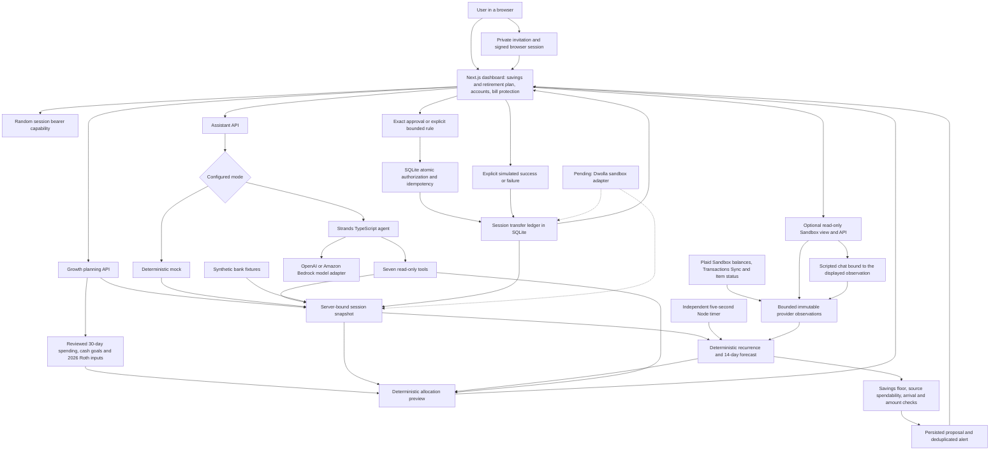

# PennyAhead architecture

Only solid-line paths are implemented. The model adapters and Strands runtime are implemented but live model execution awaits credential verification. The Sandbox view reuses the deterministic forecast; it does not enter the synthetic monitor, approval or settlement paths. Dashed Dwolla connections are planned, not operational.

For AWS, the prepared template routes browser HTTPS through CloudFront to a single EC2 container. SQLite is mounted on persistent encrypted host storage. There is no production account authentication, provider outbox, live webhook processing or AgentCore deployment. See [deployment](DEPLOYMENT.md), [forecast](FORECAST.md), [monitoring](MONITORING.md), [agent](AGENT.md) and [transfers](TRANSFERS.md) for the exact boundaries.

Savings and Roth suggestions are calculated from the session context plus entered assumptions. No growth-contribution ledger or provider execution exists yet. Growth planning is synthetic-only; the optional Plaid page remains separate. See [growth planning](GROWTH.md).
